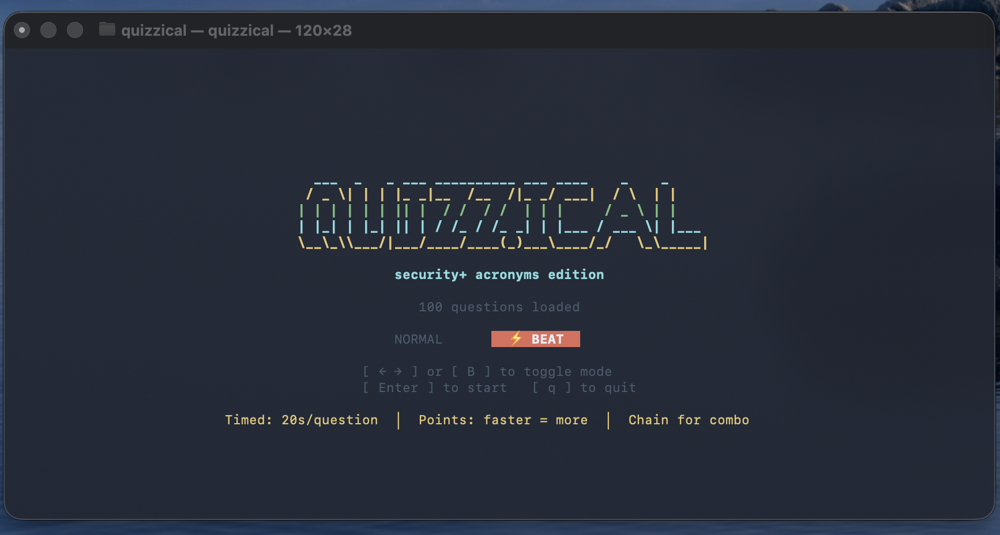

# quizzical

[](https://crates.io/crates/quizzical)



A terminal quiz game for certification exam prep. Built in Rust with a full-screen TUI, physics-based animations, and timed modes with a burning fuse timer and combo scoring.

## Install

**From crates.io** (recommended):

```bash
cargo install quizzical
```

**From source:**

```bash
git clone https://github.com/PR0CK0/quizzical
cd quizzical
cargo build --release
# binary at target/release/quizzical
```

## Usage

```bash
# startup file picker (arrow keys to select, Enter to confirm)
./target/release/quizzical

# jump straight to a deck
./target/release/quizzical --file decks/security-plus-full.json

# enable text-to-speech (Normal mode only, macOS only)
./target/release/quizzical --tts
./target/release/quizzical --file decks/security-plus-full.json --tts
```

From the title screen, use `←` / `→` to cycle modes, then `Enter` to start.

## Text-to-Speech (macOS only)

Pass `--tts` to have each question and its answer options read aloud in Normal mode. Uses the built-in macOS `say` command — no extra dependencies or API keys required. Speech stops automatically when you answer or quit. On other platforms the flag is silently ignored.

## Decks

Decks live in the `decks/` folder. Quizzical auto-discovers all `.json` files there at startup.

| File | Description |
|---|---|
| `decks/security-plus-full.json` | 333 CompTIA Security+ SY0-701 questions |
| `decks/security-plus-acronyms.json` | 100 acronym flashcards (SPF, AES, SIEM, ...) |

Answer order is randomized on every question — no memorizing positions.

### Adding a deck

Drop a `.json` file into `decks/` following this schema:

```json
{
  "name": "my deck",
  "questions": [
    {
      "domain": "Category Name",
      "question": "What does XYZ stand for?",
      "answers": [
        "The correct expansion of XYZ",
        "A plausible wrong answer",
        "Another wrong answer",
        "Yet another wrong answer"
      ],
      "correct": "The correct expansion of XYZ",
      "explanation": "XYZ stands for this because..."
    }
  ]
}
```

**Schema rules:**
- `name` — shown on the title screen as `{name} edition`
- `answers` — array of answer strings (2–4 supported); order doesn't matter, they're shuffled at runtime
- `correct` — must be the **exact text** of one of the answers
- `domain` — category label shown above the question
- `explanation` — shown after answering in Normal mode

Run `cargo test` to validate all decks in `decks/` before playing.

## Modes

### Normal
Standard flashcard quiz. One question at a time, immediate feedback with explanation, particle explosion on correct answers. Press `1`–`4` to answer.

### Hard ⚡
Timed mode with 10s per question. Answer fast for a higher score multiplier (up to 5×). Chain correct answers for a combo bonus (up to 3×). Max 1,500 pts per question.

### Deathmatch ☠
5s per question. No result screens between questions — just a quick flash and straight to the next one. The goal is to break you.

- Wrong answer or timeout resets your combo
- Quit early with `q` — you still get a full stats screen with leaderboard

Scores are saved to `~/Library/Application Support/quizzical/scores.json` (top 10 runs per OS data dir).

## Controls

| Key | Action |
|---|---|
| `1` `2` `3` `4` | Select answer |
| `q` / `Esc` | Quit / end session |
| `←` `→` | Cycle mode on title screen |
| `Enter` | Start |

## Development

```bash
cargo test        # validate decks + unit tests
cargo build --release
```
